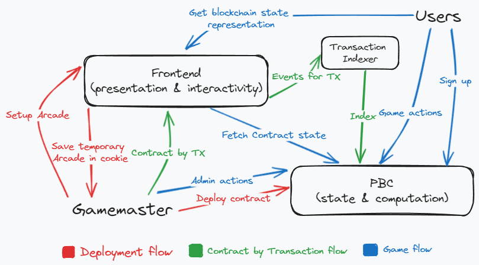

# Gamemaster UI

This directory contains the frontend code for the Gamemaster project.

The frontend is deployed on both Netlify and Vercel and is currently configured to work with the Partisia Blockchain Testnet.


## Getting Started
Before you start, you need to create a local file named `.env.local` with the following content:
```env
COOKIE_SECRET=some-very-long-secret-cookie-test-2
```

Then, you can install the dependencies and start the local development server with the following commands:
```bash
pnpm i
pnpm dev
```

## Architecture
The frontend of the Gamemaster project interacts with the Partisia Blockchain, which serves as the backend. The architecture of the frontend is illustrated in the following diagram:



## Contract Generation
The frontend uses contract ABIs that are generated manually. When a new contract version is ready to be used, run the following command to build the contract and copy it to the `src/contracts_gen` directory:
```bash
# From the root
pnpm generate
```

Please note that this is a manual process and needs to be done each time there are changes to the contract or ABI.
